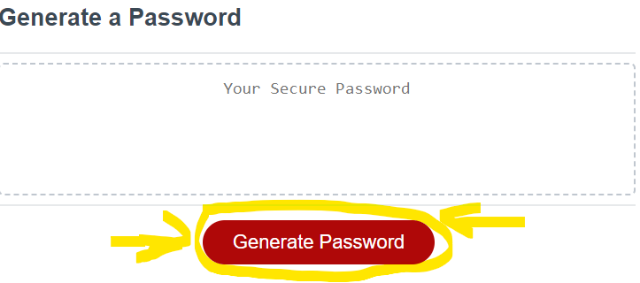
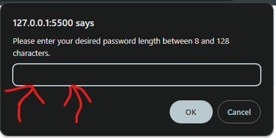
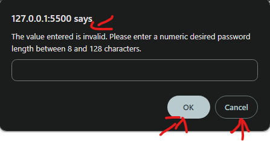
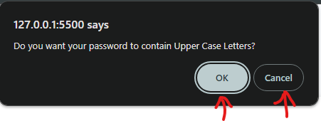
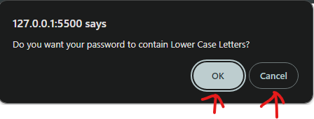
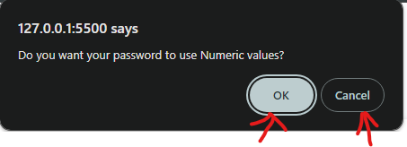
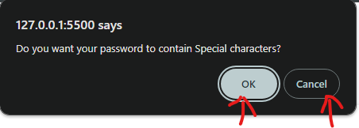
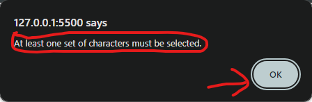
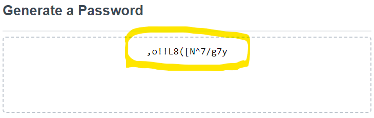

# password-generator
The goal of this project is to create an application that will allow the generation of a random password based on user-selected criteria.

__Use Instructions__

To operate this application, the user will simply need to click on the "Generate Password" button. 

Once clicked, the user will be asked a series of parameters that they would like the password to conform to.  

First, the password lenght is selected.

The passwword lenght cannot be left empty, cannot be outside of the minimum/maximum length and must be numeric.  

The user cannot proceed until these conditions are met.

The user will then select the types of characters that the password will consist of.

The application will require the user to select at least one of available character sets to build their password with.

The random password, based on the user input specifications, is then dispayed on screen.

